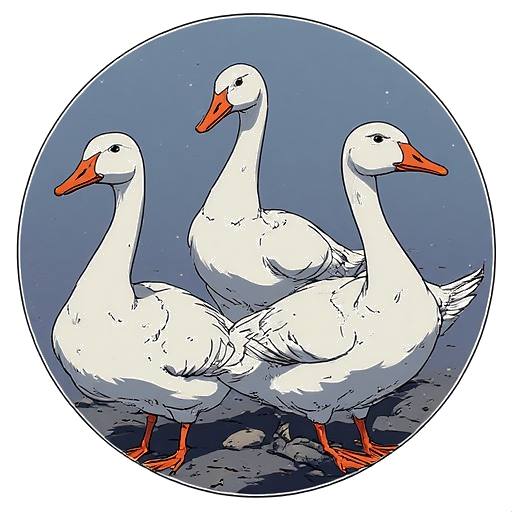

<div align="center">



# Gaggle

</div>

## ✨ What is Gaggle?

**Gaggle** is a modern application launcher designed around **community, extensibility, and customization**.

Born from a need of sharing modded versions of games with friends, Gaggle the successor of [GooseLib](https://github.com/thomasgoossen04/gooselib), aims to make self-hosting a game launcher possible, and easy.

---


## 🚀 Features

- 🖥️ **Modern Desktop Client**  
  Cross-platform frontend built with **Tauri**, **Yew**, and **Tailwind CSS** for a fast, lightweight, and polished user experience.

- 🌐 **Self-Hostable Go Backend**  
  A Go-based backend that you can fully self-host, giving you complete control over your launcher infrastructure and data.

- ⚙️ **Client Customization via `config.toml`**  
  The client behavior and appearance can be customized through a simple `config.toml` file, allowing easy configuration without recompiling.

- 🧩 **Community & Extensibility Focused**  
  Designed to support shared ecosystems, modded content, and collaborative distribution of applications or games.

- 🎮 **Built for Application Distribution**  
  Inspired by the need to share applications with friends, making launcher-based distribution straightforward and maintainable.

---

## Download

For the client go to [Releases](https://github.com/thomasgoossen04/Gaggle/releases) and download the installer called Gaggle_x.x.x_x64_en-US.msi under Assets

## 🛠 Backend Setup

Gaggle uses a **self-hostable Go backend** that handles authentication, configuration, and feature control for the client.  
The backend is configured using a single `config.toml` file.

### Running the Backend

1. Build or download the backend binary
2. Create a `config.toml` file in the same directory
3. Start the server:

```bash
./gaggle_backend
```

#### Security notes
Note that you should secure the backend behind a NGINX reverse proxy with HTTPS, since the backend uses HTTP and only accepts from localhost.

## ⚙️ Configuration
Example config.toml file, for the discord values see the next section
```toml
port = 2121
mode = "release"
admins = ["<discord ids of admin users>"]

[discord]
client_id = "<discord application client id>"
client_secret = "<discord application secret>"
redirect_uri = "https://<your.domain.com:port>/auth/discord/callback"
# auth needs at least identify and email, so keep it like this
scopes = ["identify", "email"]

[features]
# to disable the chat functionality of the client
chat_enabled = true

[access]
# Optional, if omitted anyone with a discord account can create an account
password = "SomeStrongPassword"

[session]
# login session timeout
ttl_hours = 168

[theme]
primary = "#FF7F11"     # primary accent colour (buttons)
secondary = "#ACBFA4"   # secondary accent colour (text)
accent = "#E2E8CE"      # tertiary accent colour (text)
ink = "#262626"         # background colour
ink_light = "#5a5a5a"   # background light
font = "Space Grotesk"  # font to use
radius = "4px"          # border radius of UI elements
```

## Discord authentication
Gaggle uses Discord Oauth2 to manage user login. To get the client id and secret (which you need to set in config.toml), you need to set up a Discord Application.

1. Go to [https://discord.com/developers/applications](https://discord.com/developers/applications)
2. Click New Application and give it a name.
3. Navigate to OAuth2 → General
    - Copy the Client ID & Client Secret
4. Under Redirects, add your redirect_uri (defined in config.toml)
5. Paste the values into your config.toml

## Creating your own version (fork)
In order to create your own version of Gaggle, you should first fork this repository to your own GitHub account. Once forked, you can freely customize, build, and deploy both the backend and frontend to suit your needs.

### 🧩 Dependencies
To build Gaggle from source, make sure you have the following tools installed:

- Go (for the backend)
- Rust + cargo (for the frontend)
- Tauri CLI:
```bash
cargo install tauri-cli --version "^2.0.0" --locked
```

### 🛠 Building the Backend
The backend is written in Go and lives in the ./backend directory.

Running the backend (development)

From the project root:
```bash
go run .
```
Building the backend (production)
```bash
go build .
```
This will produce a standalone backend binary that can be self-hosted.

### 🎨 Building the Frontend

The frontend is built using Tauri and Yew, and lives in the ./frontend directory.

Running the frontend (development)
```bash
cargo tauri dev
```

Building the frontend (production)
```bash
cargo tauri build
```

This will generate a native desktop application for your platform.